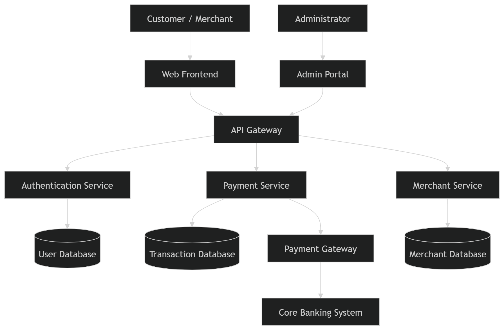

# Secure Architecture and Threat Modeling Report
# Ikramah Elahi (ie08941)
## Online Payment Processing Application

---

## Selected Scenario

**Option A: Online Payment Processing Application**

The system includes:

- Web frontend  
- API backend  
- Payment gateway integration  
- Admin portal  
- User database  
- Merchant database  
- Core banking system  

The system is assumed to be **internet-facing**, **cloud-agnostic**, and exposed to both **external attackers** and **insider threats**.

---

## 1. System Overview

This application allows customers to make online payments to merchants. Users interact with the system through a web frontend, while backend services handle authentication, payment processing, and merchant management.

The system integrates with a third-party payment gateway and a core banking system. Administrators manage the platform through a separate admin portal with elevated privileges.

---

## 2. System Definition and Architecture

### 2.1 Application Components

- **Web Frontend** – Used by customers and merchants  
- **Admin Portal** – Used by administrators  
- **Backend Services** – Authentication, payment processing, merchant management  
- **Databases** – User, merchant, and transaction data  
- **External Systems** – Payment gateway and core banking system  

---

### 2.2 Users and Roles

| Role | Description |
|---|---|
| Customer | Makes payments |
| Merchant | Receives payments |
| Administrator | Manages system and users |
| Support Staff | Limited internal access |
| Attacker | External or insider threat |

---

### 2.3 Data Types Handled

- User credentials  
- Personal identifiable information (PII)  
- Financial transaction data  
- Merchant settlement data  
- System and audit logs  

---

### 2.4 Trust Boundaries

- Between users and the web frontend  
- Between frontend and backend APIs  
- Between backend services and databases  
- Between internal systems and external payment services  
- Between admin portal and user-facing systems  

---

### 2.5 High-Level Architecture Diagram

---

## 3. Asset Identification and Security Objectives

### 3.1 Asset Inventory

| Asset | Description |
|---|---|
| Credentials | Login details and authentication tokens |
| Personal Data | User and merchant information |
| Financial Data | Payment and transaction records |
| Business Logic | Payment validation rules |
| Logs | Audit and security logs |

---

### 3.2 Security Objectives Mapping

| Asset | Confidentiality | Integrity | Availability | Accountability |
|---|---|---|---|---|
| Credentials | ✓ | ✓ | ✓ | ✓ |
| Personal Data | ✓ | ✓ | | |
| Financial Data | ✓ | ✓ | ✓ | ✓ |
| Business Logic | | ✓ | ✓ | |
| Logs | | ✓ | ✓ | ✓ |

---

## 4. Threat Modeling (STRIDE)

Structured threat modeling was performed using the **STRIDE** framework.

### 4.1 Threat Model Table

| Threat | Affected Component | Impact | Risk |
|---|---|---|---|
| Spoofing | Authentication service | Account takeover | High |
| Tampering | Payment API | Financial loss | High |
| Repudiation | Transaction system | Payment disputes | Medium |
| Information Disclosure | Databases | Data breach | High |
| Denial of Service | APIs | System downtime | Medium |
| Elevation of Privilege | Admin portal | Full system compromise | High |

---

### 4.2 Risk Reasoning Example

Administrative access is high risk because administrators have broad control over the system. If this access is abused, either intentionally or accidentally, it can affect user data, transactions, and system availability.

---

## 5. Secure Architecture Design

### 5.1 Security Controls

**Identity and Access Management**
- Role-based access control (RBAC)  
- Multi-factor authentication for administrators  

**Network Segmentation**
- Separation of admin and user access paths  
- Isolated backend services  

**Data Protection**
- Encryption of data in transit  
- Encryption of data at rest  
- Tokenization of payment information  

**Secrets Management**
- No hard-coded secrets  
- Restricted access to sensitive credentials  

**Monitoring and Logging**
- Centralized logging  
- Monitoring of admin actions  
- Alerts for suspicious behavior  

**Secure Deployment Practices**
- Principle of least privilege  
- Separate development and production environments  

---

### 5.2 Justification

These controls reduce the likelihood and impact of attacks, limit the damage caused by compromised components, and improve detection and accountability. Security is implemented in multiple layers rather than relying on a single control.

---

## 6. Risk Treatment and Residual Risk

### 6.1 Risk Treatment Decisions

| Threat | Treatment | Reason |
|---|---|---|
| Login attacks | Mitigate | MFA and rate limiting |
| Admin misuse | Mitigate | RBAC and monitoring |
| Denial of service | Mitigate | Traffic controls |
| Payment disputes | Accept | Business-related risk |
| Zero-day vulnerabilities | Accept | Cannot be fully prevented |

---

### 6.2 Residual Risk

Some risks remain due to third-party dependencies, human error, and unknown vulnerabilities. These risks are managed through continuous monitoring and incident response rather than complete elimination.
